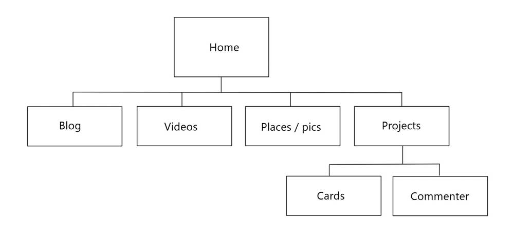

# Six Phases
The process of web design begins with information gathering (1). Designers must look at all the info they will be asked to display, spread it out on the floor and roll around in it. All those stories, descriptions and pictures must be reconciled with the goals of the site, and the intended audience. Then designers then move to site planning (2) to begin organizing a site map and deciding where all that content will fit. The third step is visual design (3), when the team debates colors and fonts and other style choices that determine the look of the site. With those decisions made, the next step is developing (4) the actual code and tools that will be the foundation of the site. Often a home page is fine-tuned, to the client's approval, and additional site pages are built around that style. Once the site is put together, the team can test internally and deliver (5) to the client, likely for more final testing. The site must work as intended, meet general web standards, and satisfy validation requirements for all devices where the site will be used. As with any team of mutant superheros, the design team's work is never done, especially if they are tasked with developing and posting new content to the site (6), to keep the audience happy. The best designers sign multi-picture deals, err ... long-term site maintenance agreements. If not, the burden of protecting humanity and maintaining the site is passed to the client to write and post new content. Roll credits.

# What is your site's primary goal or purpose? What kind of content will your site feature?
This site, I understand, is a portfolio page, so it will talk about me. I will provide a very brief hagiography, and post some photos of places I've been. I traveled a bunch in Latin America, so that's kinda cool. Also, I have developed two small code projects, so I will link or repost those. Hopefully two will grow to many!

# What is your target audience's interests and how do you see your site addressing them?
I expect my site's audience will be my fellow cohorters. So I'd like to provide them some personal and fun info to get to know me. People often connect talking about places they've traveled, so there's that. And since we are working on code together, I'll share some of the experiences I've had in that direction.

# What is the primary "action" the user should take when coming to your site? Do you want them to search for information, contact you, or see your portfolio? It's ok to have several actions at once, or different actions for different kinds of visitors.
The only actions I anticipate so far would be clicking play on some videos, or toggling through photos. Swipe left for no, right for yes, or something like that.

# What are the main things someone should know about design and user experience?
In my experience, designers can never fully anticipate how their products will be used. No amount of preparation and study will result in a product that hits the mark for every person. What the designer sees is not always what the user sees, what is obvious is not obvious, and what is unbreakable can be broken. Humans are complex things. We like structure, as well as whimsy. We embrace joy, while respecting pain and sadness. In the end, we all like stories, so web designers should always consider themselves as storytellers in a way. Lead a user down a path and give them something they want along the way. Information, products, experiences, etc.

# What is user experience design and why is it valuable?
UX design is a process of analyzing and optimizing the way a user interacts with a thing. In our case, we're talking web products. A huge component of this is understanding what users do during that experience. Are the various steps easy, frustrating, confusing, long-winded ...? Done right, a UX review can help drive more people to a service, get them to stay there longer, and leave them with a more positive experience. Ultimately, we're all competing for users' attention, so the more positive attention we get, all the better.

# Which parts of the challenge did you find tedious?
I didn't find the lesson parts of this challenge tedious. I enjoyed the relatively short and poignant discussion of design and UX. They are fascinating topics, but can also quickly become a study in navel-gazing. I admit the last thing I want to do is create a portfolio website. I know myself well enough, and I prefer sharing personal details in person. I know that talking about myself in a web page will become tedious for me. But! Fears aside, onward and upward we go.