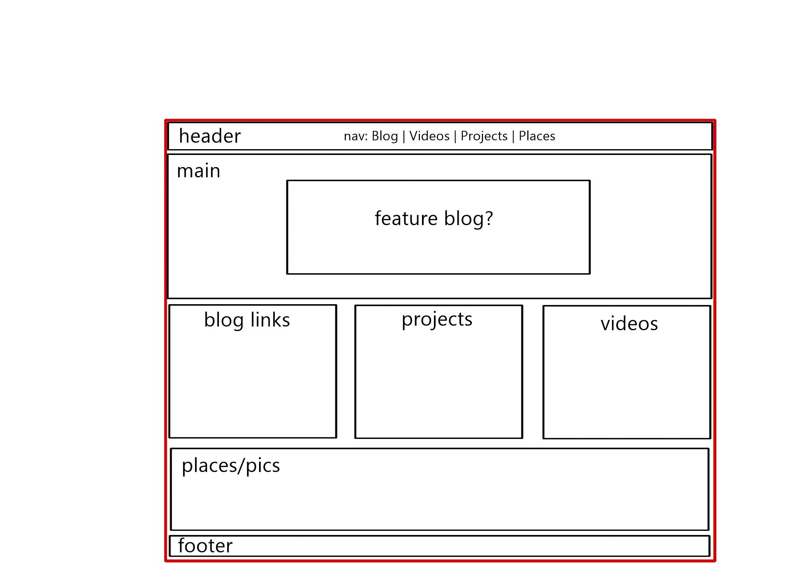
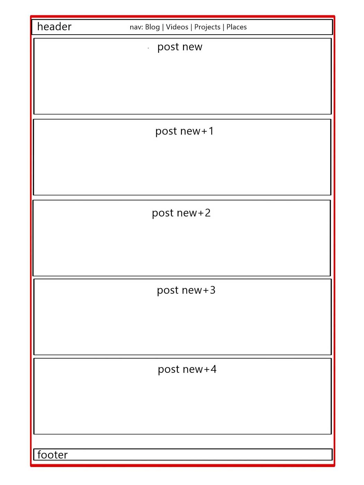

# What is a wireframe?

A wireframe is a raw outline of a web page. It indicates sections of content, often as outlined boxes. The goal is to indicate the location and size of individual nodes or pieces of content, or navigation tools.

# What are the benefits of wireframing?

Wireframing is helpful to being roughing out the bones of a page, and a site. It helps communicate the design decisions to the team and client. Everyone can see what items will get prominent locations, what items will be bigger or smaller than others, and what items will be juxtaposed. A wireframe will reveal potential problems that result from placing certain items together, or keeping them too far apart. The process also may reveal there is too much clutter, or not enough of interest.

# Did you enjoy wireframing your site?

Wireframing this site was quite simple. As a personal/portfolio site, I can't erase from my mind the hundreds of similar designs I've seen. I suppose it's an unconscious process of applying the kind of design that I already know I like. It would be a much harder challenge to do the NEXT site in this style, and make it different by overriding my personal preferences.

# Did you revise your wireframe or stick with your first idea?

I revised it after realizing I needed blog links! Read the directions, grasshopper. But as a general design, I stuck with my first instinct. If I had to add or remove the number of sections, I definitely would have to modify the design because it relies on this structure: one main section, three sub-sections.

# What questions did you ask during this challenge? What resources did you find to help you answer them?

This challenge revealed more niggling issues with git that I didn't realize I had. It's helpful to have repetition in the process, and, as a result, confront the minor hiccups in your process. I found myself looking at other people's rundowns of git process, to confirm my own process and get it done. Also, there was some chat on slack about proper markdown style for img files. I didn't realize it was different than html style, so I was able to recognize my error and fix it. Thanks team!

# Which parts of the challenge did you enjoy and which parts did you find tedious?

I enjoy rehearsing the git flow. I know I learn by doing, so repetition is good for me. Making an image file of a wireframe is tedious, mostly because I don't like drawing on the computer. Any day I encounter Adobe is a bad day. I should have done it by hand on paper. But that's also because I'm forcing myself to learn to draw on the computer, and I still. Don't. Like. It.