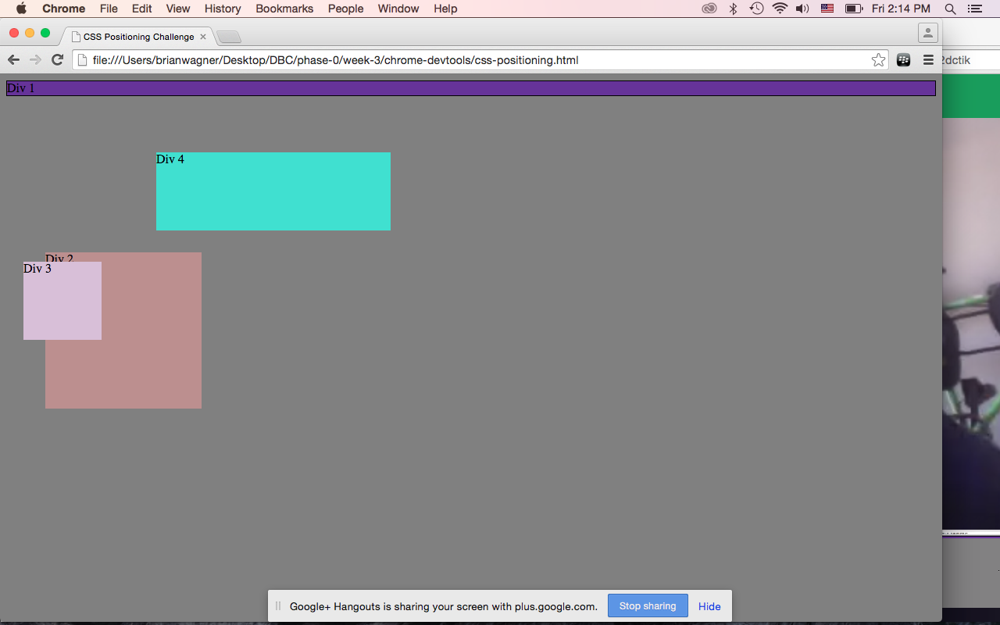
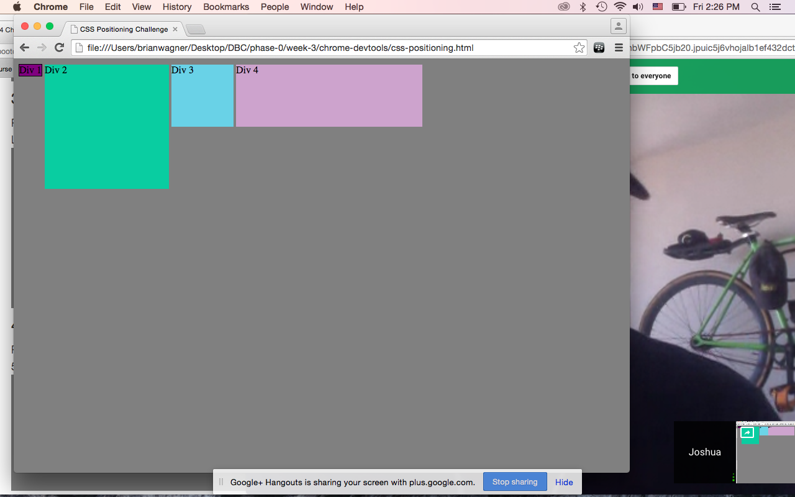
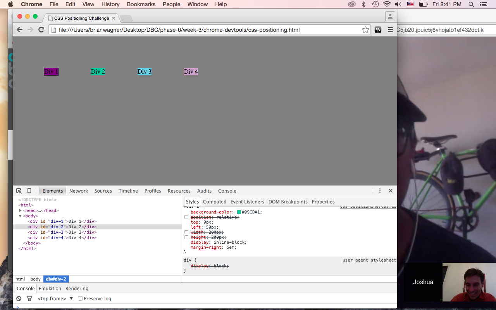
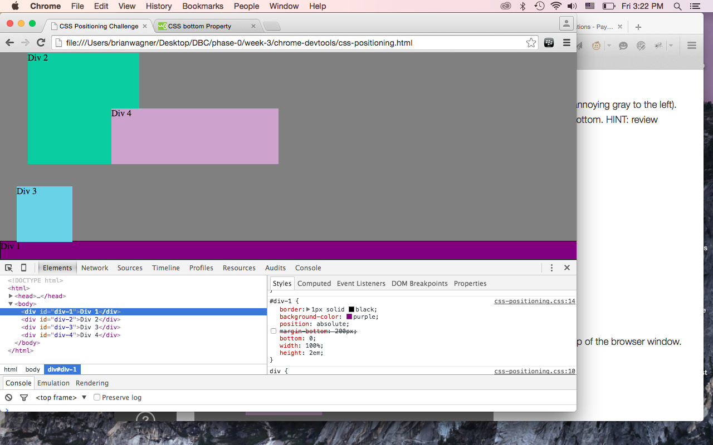
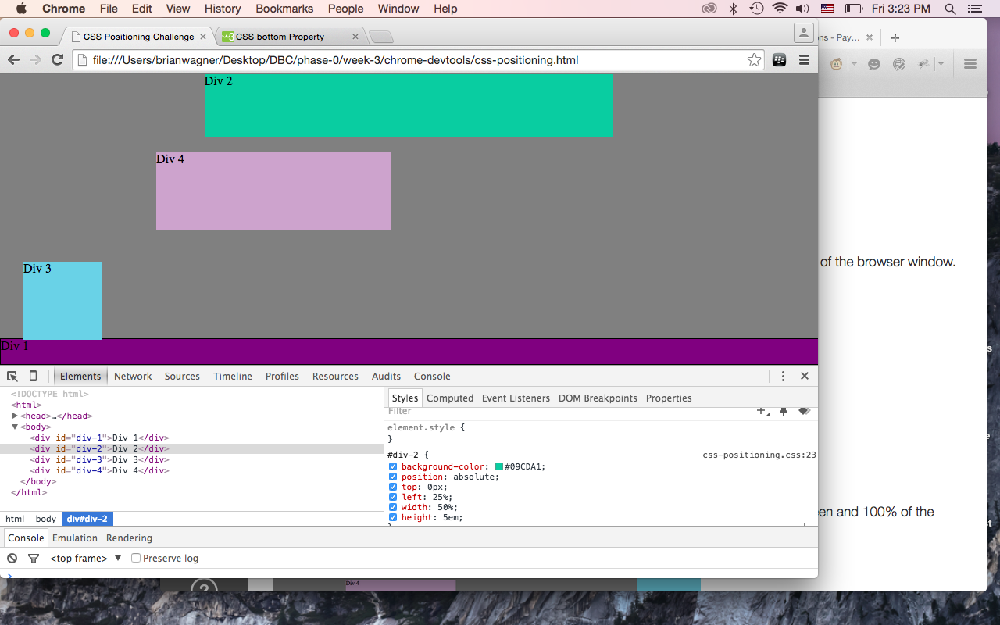
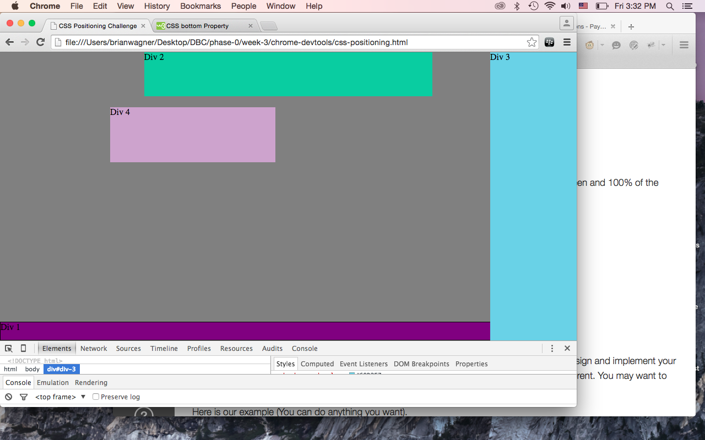
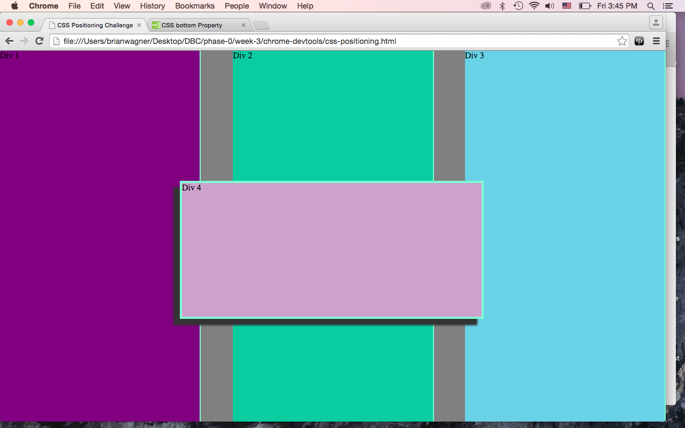

#How can you use Chrome's DevTools inspector to help you format or position elements?

The Devtools allow you to quickly fine-tune the values of your properties. It's faster than inputting the values into a CSS file and then resaving and reloading the browser. In many cases, you can add new CSS rulesets as well, to test how the values affect display, etc. One huge resource is the box model, which shows how the various rules are affecting the display, elucidating how padding and margin and border combine to produce a single result. Also it's enormously valuable to know when certain rules are overriding others. A strikethrough means it ain't working! And when you have a typo in the CSS, the browser doesn't have autocorrect. So if it doesn't show up in the CSS devtools, then you have an error in the CSS file. I know this from experience. Much experience.

#How can you resize elements on the DOM using CSS?

You can control all aspects of an existing element through the Devtools. Even remove them from the DOM. "Width" and "height" control the size; "position" is the first step to controlling the location; and throw in "z-index" to affect the back to front positioning.

#What are the differences between Absolute, Fixed, Static, and Relative positioning? Which did you find easiest to use? Which was most difficult?

"Fixed" is defined in terms of the browser window, and ignores other elements on the page. The other three do reflect other page elements. "Relative" is respective of the original position the element would have. "Absolute" and "static" offer more control, within the confines of the parent element. "Fixed" is the most self-evident of the four. It's hard to grasp the subtle differences of "absolute" and "static" because they are dependent on other elements in the DOM.

#What are the differences between Margin, Border, and Padding?

Margin is the space outside the element. Border is the edge. Padding is space inside the element. When it comes to sizing a div, for example, you can adjust padding and know it should not affect the overall width. The other two properties, however, will affect the overall space that the div occupies in the DOM.

#What was your impression of this challenge overall? (love, hate, and why?)

It was fun to play with the various position types. I had never done it. For the last challenge, I did not expect to use the properties/values I did to create what I had envisioned. It's helpful to play with colored boxes, to understand how the building blocks fit together. Most modern websites don't readily reveal all the complex positioning that goes on underneath.