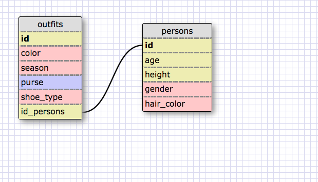

1. SELECT * FROM states;
2. SELECT * FROM regions;
3. SELECT state_name, population FROM states;
4. SELECT state_name, population FROM states
    ORDER BY population DESC;
5. SELECT state_name FROM states
    WHERE region_id == 7;
6. SELET state_name, population_density FROM states
    WHERE population_density > 50
    ORDER BY population_density ASC;
7. SELECT state_name FROM states
    WHERE population > 1000000 AND population < 1500000;
8. SELECT state_name, region_id FROM states
    ORDER BY region_id ASC;
9. SELECT region_name FROM regions
    WHERE region_name LIKE '%Central%';
10. SELECT region_name, state_name FROM states
    INNER JOIN regions
    ON states.region_id = regions.id
    ORDER BY region_ID ASC;

Reflect

Databases are designed to organize data in a way that is easy to
create and access. In many cases, the data will be accessed far
more frequently than it will be created.

A one-to-many relationship is typical in databases, because one
piece of data may be intrinsically connected to several other pieces.
A person will have various characteristics. An office will have
many workers. A region will have many different communities within
it. This is important to databases because I can call one piece of data
 -- the key -- and have access to all those others as well.
 In literature, we call it synechdoche.

A primary key is the unique data ID that is used to access a
data record. I invoke the key and get access to all the other
data associated with that record inside the table.
A foreign key is used to access related data in a separate
table. It's a way to link data in two tables.
A primary key must be unique in that table. A foreign key may not
be unique in the table; but it should point to data in another table.

The format for selecting data from a table is:
SELECT [column being selected] FROM [table name]
In this format, the commands should be in caps. The data and table
names, etc. should be lower case. A single statement ends with a
semicolon. We can use line breaks to separate the individual actions
of our statement, such as to include conditions, a grouping command,
or order functions.