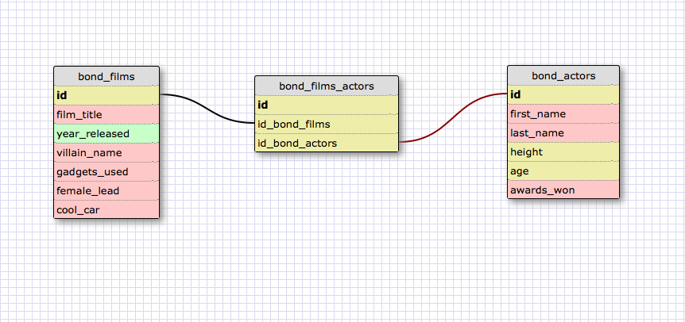

My mind caught on to James Bond films and actors as an example for a schema,
so sorry grocery list. It seemed relevant to link the actors who played Bond,
and the films. In a way, you can query each of them independently, or together.
That's the point here, right?

A one-to-one database is a way of separating data from one entity in half.
One database holds data relevant to a certain aspect; another DB holds data
relevant to something else. They are linked intrinsically, but the user can
choose whether to access one set of data, the other, or both. It simplifies
queries.

I can imagine a scenario where you had a 1-to-1 DB for people and their things.
A bank customer may have a bunch of data worth organizing in one DB. Then they get
a home loan and you want that in another DB. Or a business loan, and you put it
somewhere else, where you can access it easily through the customer info, but not
for every query on the customer.

A many-to-many schema is a way to link various things to various ways of organizing
those things. The items in each DB are not unique to any of the things in the other
DB.

Maybe you want to organize clothing brands and department stores. So brands in one
DB and stores in another. The products from Levi's can go to several stores. And
each store sells several brands of jeans.

The hardest part about imagining these DB schema is envisioning how the data will be
accessed. Anticipating the end-user action. Only then will you grasp when a single query
will be enough, or you're generating too many unnecessary queries.