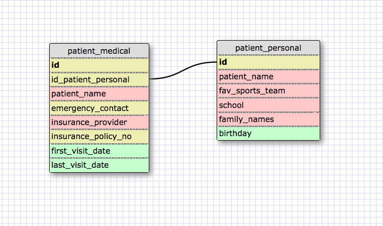

I made a schema for a doctor/dentist office. Each patient has two sets
of data: one related to medical care, another related to their interests
and family. I imagine the care staff would want to access the medical
info. While the receptionist and doctor would want to access the
personal info during an office visit. So the data are linked one to one,
but no need to access both sets for all given instances. (A million
years ago my mom noticed the orthodontist kept a cheat sheet on patient
files about their favorite football teams, etc. Never forgot that!)

